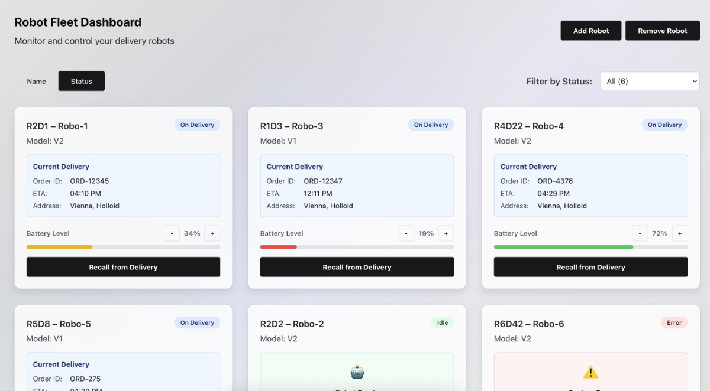

# Robot Fleet Dashboard

A modern, responsive React dashboard for monitoring and controlling delivery robots. Built with React, TypeScript, Vite, and Chakra UI.



## Features

- **Real-time Robot Monitoring**: View robot status, battery levels, and current deliveries
- **Interactive Controls**: Return robots to base with a single click
- **Dynamic Fleet Management**: Add and remove robots from the fleet
- **Responsive Design**: Optimized for desktop, tablet, and mobile devices
- **Modern UI**: Built with Chakra UI for a clean, professional interface
- **TypeScript Support**: Full type safety throughout the application

## Technology Stack

- **Frontend Framework**: React 19 with TypeScript
- **Build Tool**: Vite 7
- **UI Library**: Chakra UI v3
- **Styling**: Emotion (CSS-in-JS)
- **Icons**: Framer Motion for animations
- **Development**: ESLint for code quality

## Project Structure

```text
src/
├── components/
│   └── RobotCard.tsx      # Individual robot card component
├── types/
│   └── robot.ts           # TypeScript interfaces and sample data
├── App.tsx                # Main application component
├── main.tsx               # Application entry point
└── index.css              # Global styles
```

## Getting Started

### Prerequisites

- Node.js 18+
- npm or yarn package manager

### Installation

1. Clone the repository

2. Install dependencies:

   ```bash
   npm install
   ```

3. Start the development server:

   ```bash
   npm run dev
   ```

4. Open your browser and navigate to `http://localhost:5173`

### Available Scripts

- `npm run dev` - Start development server with hot reload
- `npm run build` - Build for production
- `npm run lint` - Run ESLint code analysis
- `npm run preview` - Preview production build locally

## Robot Data Structure

Each robot contains the following information:

```typescript
interface Robot {
  robotId: string;
  name: string;
  model: string;
  status: "On Delivery" | "Idle" | "Charging" | "Error" | "Returning";
  batteryLevel: number;
  location: {
    latitude: number;
    longitude: number;
  };
  currentOrder: {
    orderId: string;
    customerName: string;
    deliveryAddress: string;
    estimatedDelivery: string;
  };
}
```

## Features in Detail

### Robot Cards

- Display robot name, ID, and current status
- Show battery level with color-coded progress indicator
- Display current delivery information
- Status badges with color coding (Green: Idle, Blue: On Delivery, Orange: Returning, etc.)

### Fleet Management

- **Add Robot**: Generates new robots with random properties
- **Remove Robot**: Removes robots from the fleet
- **Return to Base**: Individual robot control

### Responsive Design

- Mobile-first approach with breakpoints for tablet and desktop
- Adaptive button sizing and layout
- Optimized touch interactions for mobile devices

## Development

This project uses modern React patterns and TypeScript for type safety. The codebase follows these principles:

- **Component-based architecture** for maintainability
- **TypeScript interfaces** for type safety
- **Responsive design** using Chakra UI's responsive props
- **State management** with React hooks
- **Modern CSS** with Chakra UI's design system

## Contributing

1. Fork the repository
2. Create your feature branch (`git checkout -b feature/amazing-feature`)
3. Commit your changes (`git commit -m 'Add some amazing feature'`)
4. Push to the branch (`git push origin feature/amazing-feature`)
5. Open a Pull Request

## License

This project is part of a coding assessment and is for demonstration purposes.
